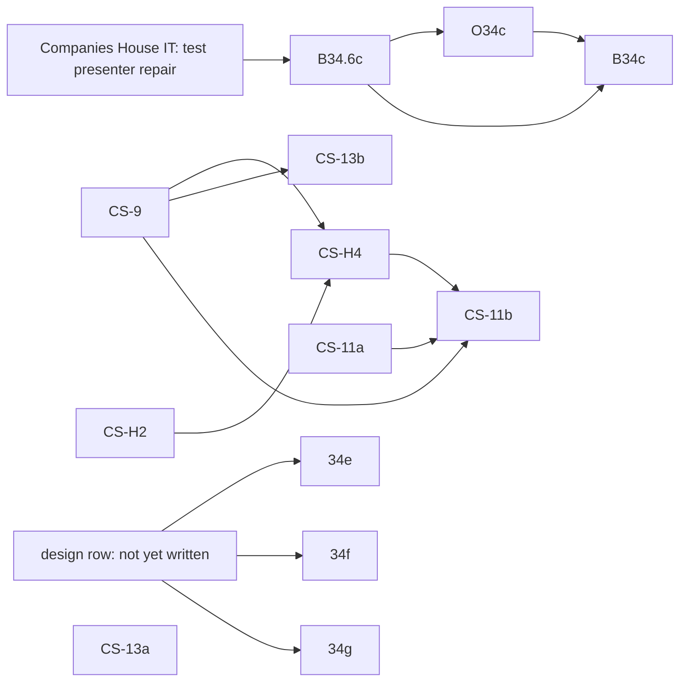

<!-- SPDX-License-Identifier: LicenseRef-PolyForm-Internal-Use-1.0.0 -->
<!-- Copyright (C) 2006-2026 DIY Accounting Limited -->

# PLAN: Companies House filing

Replaces the separate accounts-filing, confirmation-statement and filing-coverage plans this
repository used to carry.

## User assertions

> Create a PLAN_\*.md doc for this [filing a confirmation statement by API] ... have a Fable 5.1
> sub-agent design it to fit in with our existing offerings and split into tasks

> create a separate PLAN_\*.md with a list of all the companies house APIs and or XML gateways that
> we could reasonably cover (no tasks on the board for that one, it's an interesting one stop shop
> opening up scheduled filings)

## Where each filing stands

| Filing | API and credentials | Sandbox (test service) | Live (prod) | Finance |
|---|---|---|---|---|
| Company lookup | REST API key, no presenter | n/a | live | free |
| Registered office change | REST, OAuth as the company's user, no presenter | proven | live, proven on DIY Accounting Limited | free |
| Registered email change | REST, OAuth as the company's user, no presenter | proven | live, proven on DIY Accounting Limited | free |
| Micro-entity accounts | XML Gateway, presenter id + code, package reference | test presenter 66666727000: 000004 acknowledged 2026-09-13; status lookups fail until Companies House IT fixes the test account (B34.6c) | the credit-account presenter: authenticates on the live gateway since 2026-09-26; needs live clearance and the live package reference (O34c), then B34c | no Companies House fee; customer pays `resident-ltd` 99p a month (listed on ci only) |
| Confirmation statement | XML Gateway, as above | test presenter 66666727000: endpoint and schemas confirmed 2026-09-26; not run (CS-9) | the credit-account presenter: needs CS-9, software authorisation (CS-H4), then CS-11b | £50 Companies House fee debited from the credit account behind the credit-account presenter; customer pays £61.35 by Stripe (test price done; live price with CS-11b) |
| PSC verification statement (VS01) | XML Gateway, as above | test presenter 66666727000: CS-13b | the credit-account presenter: after CS-13a and CS-13b | Companies House fee to check |

**Presenters**

| Presenter | Environment | Issued | Status |
|---|---|---|---|
| Test presenter 66666727000 | Test service | 2026-09-11 | Status lookups broken; Companies House IT is fixing it (B34.6c) |
| E0000052288 | Live | 2026-09-05 | Not used for filing; holds no credit account |
| The credit-account presenter | Live | 2026-09-25, with the credit account, £500 limit | Authenticates on the live gateway since 2026-09-26. Its id, code and the account number are in `../NEXT_OPERATOR_RUNBOOK.md` task A, which this repository does not carry — never write the presenter id, the account number or any code into this file |

Test package reference: 0012. The live reference comes with O34c (accounts) and CS-H4 (confirmation
statement).

## Dependency graph

- B34.6c: blocked by Companies House IT repairing the test presenter account (no row; external)
- O34c: blocked by B34.6c
- B34c: blocked by B34.6c and O34c
- CS-H2: blocked by nothing, ready to send
- CS-9: blocked by nothing (test service, test presenter and the schemas confirmed by probe on 2026-09-26)
- CS-H4: blocked by CS-9 and CS-H2
- CS-11a: blocked by nothing (the fee-mode CDK wiring)
- CS-11b: blocked by CS-9, CS-H4 and CS-11a
- CS-13a: blocked by nothing (its fixture landed with CS-1, closed)
- CS-13b: blocked by CS-9
- 34e, 34f, 34g: blocked by a design row that still needs writing. BACKLOG.md cites "NEXT.md
  B34.8" as the row that designs them; that label is closed against unrelated work (lifting the
  company-lookup page to prod) and is not on `NEXT.md`, so the design row does not exist yet.

## Operator dates

The PSC verification window for DIY Accounting Limited's own director-PSCs runs 22 September to
5 October 2026. The confirmation statement for the 2026-09-21 review date went by WebFiling on
2026-09-24 (submission 119-158484, accepted). Submit cannot file the PSC codes in time, so they go
through the Companies House PSC web service by 5 October 2026.

## Gateway envelope and authentication

One endpoint for every form and every poll:
`https://xmlgw.companieshouse.gov.uk/v1-0/xmlgw/Gateway`. POST, `Content-Type: text/xml`, UTF-8.
The test service is the same URL with `<GatewayTest>1</GatewayTest>` and the test presenter's
credentials. The schemas live since 18 November 2025 (the confirmation and PSC verification
statements) may need a sandpit staging host instead while the test service catches up — Q1 below.

`GovTalkMessage` (`http://www.govtalk.gov.uk/CM/envelope`, `EnvelopeVersion` 1.0):
`Header/MessageDetails` carries `Class` (`Accounts`, `ConfirmationAndVerificationStatement`,
`GetSubmissionStatus`, …), `Qualifier` `request`, and a `TransactionID` that is unique and
increasing (epoch milliseconds). `Header/SenderDetails/IDAuthentication` carries `SenderID`, the
lowercase MD5 of the presenter id, and `Authentication` with `Method` `clear` and `Value`, the
lowercase MD5 of the presenter authentication code — hash first, then lowercase; the wrong order
returns error 502.

`SubmissionNumber` is 6 characters, unique per presenter across every form (one shared counter,
allocated from an atomic DynamoDB counter, rendered base36 and zero-padded). A `GovTalkErrors`
block means the submission never reached Companies House (`RaisedBy`, `Number`, `Type` of `fatal`,
`business` or `warning`, `Text`, `Location`); otherwise the answer is an acknowledgement carrying
`GatewayTimestamp` and `PollInterval`.

Poll with `Class` `GetSubmissionStatus`. The answer is `Body/SubmissionStatus/Status` with
`StatusCode` (`ACCEPT`, `REJECT`, `PENDING`, `PARKED`) and, on a reject, `Rejections/Reject`
entries of `RejectCode`, `Description` and `InstanceNumber`. Companies House keeps a result for 90
days, then answers "No Transaction Found". Error codes seen or documented: 502 authorisation
failure; 5003 "Account Unknown"; 5006/9984 insufficient funds on the credit account; 9999 generic
failure, including "No presenter ID supplied" (the symptom on submission 000004 today).

Persistence follows one pattern for every form: `putAsyncRequest` records the submission number as
pending, the poll route moves it to completed or failed, and an accepted filing writes a receipt
with `putReceipt`. The company authentication code and any personal verification code are typed on
the page, sent on the one call that needs them, and never stored.

## Accounts filing (FRS 105 micro-entity)

Built and live on ci: the iXBRL generator (`app/services/microEntityAccountsIxbrl.js`), the shared
envelope builder (`app/services/companiesHouseXmlGateway.js`), the simulator route, three Lambdas,
the page and its behaviour suite. The entry point is pinned to the FRS 102 2026-01-01 taxonomy (FRS
105 accounts use the FRS 102 entry point); `AccountingStandardsApplied` carries the `Micro-entities`
member; the four audit-exemption statements are checked by phrase; every emitted concept is checked
against `fixtures/frc-taxonomy/frs-102-2026-concepts.json`. `FormIdentifier` is `Accounts`,
`Category` `ACCOUNTS`, `Filename` `Accounts.xml`.

Open: the test presenter's status lookups answer 9999 until Companies House IT repairs the test
account (B34.6c); once they do, the live credit-account presenter needs clearing for live filing
and the live package reference (O34c), then one proof filing (B34c).

## Confirmation statement (CS01) and PSC verification (VS01)

Since 18 November 2025 the schema is `ConfirmationAndVerificationStatement-v1-0.xsd`, carrying the
directors' verification statement and the lawful-purpose statement; both the envelope `Class` and
the `FormIdentifier` are `ConfirmationAndVerificationStatement`. `ConfirmationStatement-v1-3.xsd` is
still listed live but carries no verification block. **Schema choice**: once every current officer
is verified, the next statement reverts to `ConfirmationStatement-v1-3.xsd` — resending the
verification block once it is no longer needed gives reject 12682. The builder reads each officer's
`identity_verification_details.appointment_verification_end_on` from the public data API
(`9999-12-31` means verified) and picks the schema accordingly.

**Journey** (`web/public/companies-house/fileConfirmationStatement.html`, five views): company
lookup; the authentication code, which unlocks two gateway reads (`CompanyDataRequest`,
`PaymentPeriodsRequest`) for the register data and the fee status; review and change (review date,
SIC codes, statement of capital and shareholdings, registered email, the lawful purpose tick box,
one verification row per current director); preview; submit and poll, then the PSC follow-up
prompt for each director-PSC.

**The XML body**, elements in schema order and sent only when named:

| Element | Sent when |
|---|---|
| `TradingOnMarket`, `DTR5Applies` | always, `false` (private company) |
| `ReviewDate` | always |
| `SICCodes/SICCode` | when changed |
| `StatementOfCapital`, `Shareholdings` | when capital or holdings changed (Q2 open) |
| `RegisteredEmailAddress` | when changed |
| `AcceptLawfulPurposeStatement`, `StateConfirmation` | always, `true` |
| `VerificationStatement/Director/Person` | always, one per current director, with `NameMismatchReason` only when the verified name differs |

**The fee.** £50 with the first statement of a 12-month payment period (£110 paper), since 1
February 2026, debited from the credit account behind the presenter — nothing in the envelope
carries payment; `PaymentPeriodsRequest` says whether this submission is due. Submit recovers it
from the customer by Stripe Checkout before submitting, at (Companies House fee + Stripe fee) ×
1.2: £61.35 for the £50 fee. The Stripe test price and the charging path are live (CS-10a to
CS-10d, closed); the live price lands with CS-11b.

**Verification answers** (Cowork's `../REPORT_CH_IDENTITY_VERIFICATION.md`, 2026-09-23):

| Id | Answer |
|---|---|
| V1 | An unverified director blocks the statement; every current director needs a code before the page submits |
| V2 | `Person` carries the register name; `NameMismatchReason` only when the verified name differs. `OtherForenames` is enforced |
| V3 | The company may pass its directors' codes to whoever files; Submit takes them at filing time and stores none |
| V4 | PSC codes cannot go in the statement — they go through the PSC web service or `PSCVerificationStatement-v1-0.xsd`, after the statement, inside the window starting the day after the review date |
| V5 | DIYA has three directors, all PSCs, each with a middle name |
| V6 | No ACSP is needed for DIYA's own filing. Companies House's published rule for software providers: an ACSP is needed when the provider delivers filings for its clients through its software and is responsible for paying and engaging with Companies House; not when clients use the software with their own Companies House accounts. Submit presenting customers' filings under its presenter and paying from its credit account matches the first case, so ACSP registration applies once it is required for filing on behalf of others, no earlier than November 2027 with six months' notice. The alternative that avoids it: customers file under their own presenter accounts. CS-H2 asks the XML team to confirm |

**Open questions**

| Id | Question | Owner |
|---|---|---|
| Q1 | Where to test: answered by probe on 2026-09-26. The test service `https://xmlgw.companieshouse.gov.uk/v1-0/xmlgw/Gateway` with `GatewayTest` 1 and the test presenter accepts `ConfirmationAndVerificationStatement-v1-0` and `PSCVerificationStatement-v1-0` (its `/SchemaStatus`) and answers `CompanyDataRequest` for 00001350, 04549236, 06060501, 03950344, 04615520, 01966794; the live presenter is refused there; the sandpit staging host with the live presenter validates schemas only | CS-9 |
| Q2 | Does a no-change statement pass without `Shareholdings`, or must every statement from a private company carry the full holder list? | CS-9 |
| Q3 | Does the test service accept a statement whose director has no code, and what reject code names an unverified director? | CS-9 |
| Q4 | Software authorisation for the form: how many CS01 tests, and whether the accounts package reference covers it or a second one is issued | Operator (CS-H4) |

## Horizons

**PSC verification statement (VS01).** CS-13 splits into the build and the sandbox proof. CS-13a:
`buildPscVerificationStatementSubmission` over `PSCVerificationStatement-v1-0.xsd` (its fixture
landed with CS-1), a submit and poll Lambda pair through the shared `pollSubmission`, a simulator
class, tests, and a result-view section on the confirmation statement page for each director-PSC —
machine-only, nothing blocks it. CS-13b: the sandbox proof against the test service, blocked by
CS-9.

**FRS 102 section 1A small-company accounts (34e), dormant company accounts (34f), and CT600
pairing (34g)** all reuse the FRS 102 entry point and the accounts envelope this plan's Accounts
section already builds. FRS 102 1A adds the small-companies-regime statements, a directors' report
and a profit and loss account. Dormant accounts are the micro-entity filing with a dormant flag, a
section 480 statement in place of section 477, and a share-allocation note. CT600 pairing sends the
same balance sheet's accounts iXBRL, plus a computations iXBRL, to HMRC's Transaction Engine
alongside the CT600 return, so one balance sheet serves both filings. None of the three has a
design row yet — see the dependency graph.

**The wider Companies House catalogue.** Beyond the filings above, Companies House exposes: the
Public Data API (register reads, no auth beyond an API key); the Streaming API (register changes as
they happen); the Document API (filed document content); the XML Gateway's other input-side reads
(`MembersRegisterDataRequest`, `ChargeSearch`, `GetDocument`, `EReminders`); and XML Gateway forms
for officer appointment, resignation and change, PSC notification and change, accounting reference
date change, name change, share allotment, charge registration, and incorporation. Every recurring
deadline (accounts due, confirmation statement due, a director's or PSC's verification code due,
the CT600) sits on the company's public profile with no authentication code, so a reminder or a
filing queue can be built from the company number alone once a filing exists to act on it. The
order this plan grows into, by deadline served: accounts, the confirmation statement with the
verification statement, the PSC verification statement, then the 14-day event forms that keep the
register consistent before each confirmation statement, then share allotments and accounting
reference date changes.

## Tasks

| Id | What | Files | Model | Blocked by | Class |
|---|---|---|---|---|---|
| B34.6c | Poll test submission 000004 once Companies House IT confirms the test presenter account works; pin the returned `StatusCode` as a case in `companiesHouseAccountsGet.test.js` | ~1 | Sonnet | Companies House IT | Blocked |
| O34c | Ask the XML team to clear the credit-account presenter for live accounts filing and issue the live package reference; set the live presenter id, code and package reference on GitHub's `prod` environment | 0 | none | B34.6c | Blocked |
| B34c | `CompaniesHouseStack.java` sets the prod gateway values; one accounts filing on the prod lane for the operator's own company, polled to a terminal state; `prod` added to the activity's `environments` and `resident`'s listing | ~5 | Sonnet | B34.6c, O34c | Blocked |
| CS-H2 | Send `../DRAFT_EMAIL_XMLGW_CS01.md` to `xml@companieshouse.gov.uk` as a new thread (Q1, Q4); paste the answers into CS-9's row; Q2 and Q3 are settled by CS-9's sandbox cases | 0 | none | nothing | Human-driven |
| CS-9 | Sandbox proof: a `CompanyDataRequest`, a no-change statement, a SIC change, one with `Shareholdings`, one with a blank director code, each polled to a terminal state and pinned in the simulator; settles Q2 and Q3 | 3 | Sonnet | none | Machine-only |
| CS-H4 | The XML team tests CS-9's submissions and issues the package reference for the confirmation statement | 0 | none | CS-9 | Blocked |
| CS-13a | Build the PSC verification statement: XML builder, submit and poll Lambdas, simulator class, tests, result-view section | ~8 | Sonnet | nothing | Machine-only |
| CS-13b | Sandbox proof of the PSC verification statement against the test service | ~1 | Sonnet | CS-9 | Blocked |
| CS-11a | `COMPANIES_HOUSE_CS_FEE_MODE` as a `CompaniesHouseStack.java` prop, set to `operator` only where the environment config names it, so operator mode is reachable when deployed | ~2 | Haiku | none | Machine-only |
| CS-11b | `prod` on the confirmation statement activity, prod gateway values and the live package reference, the operator-mode proof filing, `compliance.toml` rows for the credit account and the authorisation | ~4 | Haiku | CS-9, CS-H4, CS-11a | Blocked |
