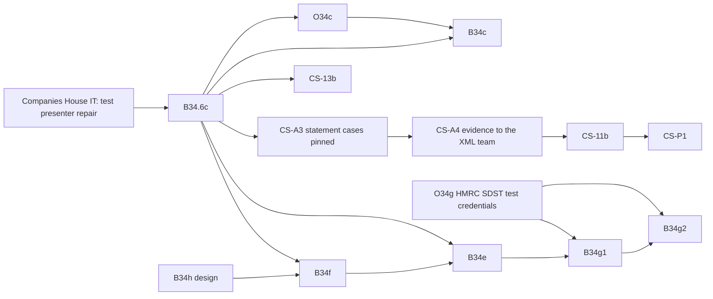

<!-- SPDX-License-Identifier: LicenseRef-PolyForm-Internal-Use-1.0.0 -->
<!-- Copyright (C) 2006-2026 DIY Accounting Limited -->

# PLAN: Companies House filing

Replaces the separate accounts-filing, confirmation-statement and filing-coverage plans this
repository used to carry.

## User assertions

> Create a PLAN_\*.md doc for this [filing a confirmation statement by API] ... have a Fable 5.1
> sub-agent design it to fit in with our existing offerings and split into tasks

> create a separate PLAN_\*.md with a list of all the companies house APIs and or XML gateways that
> we could reasonably cover (no tasks on the board for that one, it's an interesting one stop shop
> opening up scheduled filings)

> instead of asking [the XML team how many tests authorisation needs], define our own assumed
> Companies House test criteria, build to them, exercise them continuously, and submit the
> evidence (operator, 2026-09-26)

> Customers file now, under our presenter; ACSP registration itself waits (no sooner than
> November 2027, at least six months' notice) (operator, 2026-09-26)

## Scope

DIY Accounting Limited files its own confirmation statement, PSC verification statements and
micro-entity accounts through Submit, under its own credit-account presenter. Customers get the
same filings on prod as soon as each is ready, under the same presenter. This is lawful until
Companies House requires ACSP registration for filing on behalf of others (no sooner than November
2027, at least six months' notice; `../private.diyaccounting.co.uk/engineering/submit/backlog/PLAN_COMPANIES_HOUSE_ACSP.md` covers that registration and the
near-term alternative of filing under a customer's own presenter, CS-P1).

CS-11b (the confirmation statement) and B34c/O34c (accounts) are each a customer prod launch: the
catalogue listing, the live Stripe price, and one proof filing on the operator's own company
first.

## Where each filing stands

| Filing | API and credentials | Sandbox (test service) | Live (prod) | Finance |
|---|---|---|---|---|
| Company lookup | REST API key, no presenter | n/a | live | free |
| Registered office change | REST, OAuth as the company's user, no presenter | proven | live, proven on DIY Accounting Limited | free |
| Registered email change | REST, OAuth as the company's user, no presenter | proven | live, proven on DIY Accounting Limited | free |
| Micro-entity accounts | XML Gateway, presenter id + code, package reference | test presenter 00000000000: 000004 acknowledged 2026-09-13; status lookups fail until Companies House IT fixes the test account (B34.6c) | the credit-account presenter: authenticates on the live gateway since 2026-09-26; needs live clearance and the live package reference (O34c), then B34c | no Companies House fee; customer pays `resident-ltd` 99p a month (listed on ci only) |
| Confirmation statement | XML Gateway, as above | test presenter 00000000000: harness run 36295600451: every case passes the gateway at submit, every status poll answers 9999 until Companies House repairs the presenter | the credit-account presenter: needs the cases pinned (CS-A3), software authorisation (CS-A4), then CS-11b (the operator's own proof filing, then customers) | our presenter: customer pays £61.35 by Stripe, Companies House charges the £50 fee to the credit account behind the presenter; the operator's own filings skip the Stripe charge (the fee waiver for listed company numbers, CS-11a); own presenter (CS-P1): Companies House charges £50 to the customer's own credit account, no Submit fee |
| PSC verification statement (VS01) | XML Gateway, as above | test presenter 00000000000: CS-13b | the credit-account presenter: after CS-13b | Companies House fee to check |

**Presenters**

| Presenter | Environment | Issued | Status |
|---|---|---|---|
| Test presenter 00000000000 | Test service | 2026-09-11 | Status lookups broken; Companies House IT is fixing it (B34.6c) |
| E0000000000 | Live | 2026-09-05 | Not used for filing; holds no credit account |
| The credit-account presenter | Live | 2026-09-25, with the credit account, £500 limit | Authenticates on the live gateway since 2026-09-26. Its id, code and the account number are in `../private.diyaccounting.co.uk/operator/NEXT_OPERATOR_RUNBOOK.md` task A, which this repository does not carry — never write the presenter id, the account number or any code into this file |

Test package reference: 0012. The live reference comes with O34c (accounts) and CS-A4 (confirmation
statement).

## Dependency graph

```mermaid
flowchart LR
    CHIT[Companies House IT: test presenter repair] --> B346c[B34.6c]
    B346c --> O34c
    B346c --> B34c
    O34c --> B34c
    B346c --> CSA3[CS-A3 statement cases pinned]
    B346c --> CS13b[CS-13b]
    CSA3 --> CSA4[CS-A4 evidence to the XML team]
    CSA4 --> CS11b[CS-11b]
    CS11b --> CSP1[CS-P1]
    B34h[B34h design] --> B34f
    B34f --> B34e
    B34e --> B34g1
    B34g1 --> B34g2
    O34g[O34g HMRC SDST test credentials] --> B34g1
    O34g --> B34g2
    B346c --> B34f
    B346c --> B34e
```

- B34.6c: blocked by Companies House IT repairing the test presenter account (no row; external)
- O34c: blocked by B34.6c
- B34c: blocked by B34.6c and O34c
- CS-A3: blocked by B34.6c (every status poll answers 9999 until the test presenter is repaired)
- CS-13b: blocked by B34.6c, as CS-A3
- CS-A4: blocked by CS-A3
- CS-11b: blocked by CS-A4
- CS-P1: blocked by CS-11b (it adds a second payment path to the journey CS-11b launches)
- B34f: blocked by B34h; its terminal-state proof by B34.6c
- B34e: blocked by B34f (shared builder and Lambdas); its terminal-state proof by B34.6c
- B34g1: blocked by B34e (the CT600 carries B34e's full accounts); its ETS proof by O34g
- B34g2: blocked by B34g1 and O34g

## Operator dates

None open.

## Gateway envelope and authentication

One endpoint for every form and every poll:
`https://xmlgw.companieshouse.gov.uk/v1-0/xmlgw/Gateway`. POST, `Content-Type: text/xml`, UTF-8.
The test service is the same URL with `<GatewayTest>1</GatewayTest>` and the test presenter's
credentials. The test service accepts the confirmation and PSC verification statement schemas
live since 18 November 2025 (Q1 below).

`GovTalkMessage` (`http://www.govtalk.gov.uk/CM/envelope`, `EnvelopeVersion` 1.0):
`Header/MessageDetails` carries `Class` (`Accounts`, `ConfirmationAndVerificationStatement`,
`GetSubmissionStatus`, …), `Qualifier` `request`, and a `TransactionID` that is unique and
increasing (epoch milliseconds). `Header/SenderDetails/IDAuthentication` carries `SenderID`, the
lowercase MD5 of the presenter id, and `Authentication` with `Method` `clear` and `Value`, the
lowercase MD5 of the presenter authentication code — hash first, then lowercase; the wrong order
returns error 502.

`SubmissionNumber` is 6 characters, unique per presenter across every form (one shared counter,
allocated from an atomic DynamoDB counter, rendered base36 and zero-padded). A `GovTalkErrors`
block means the submission never reached Companies House (`RaisedBy`, `Number`, `Type` of `fatal`,
`business` or `warning`, `Text`, `Location`); otherwise the answer is an acknowledgement carrying
`GatewayTimestamp` and `PollInterval`.

Poll with `Class` `GetSubmissionStatus`. The answer is `Body/SubmissionStatus/Status` with
`StatusCode` (`ACCEPT`, `REJECT`, `PENDING`, `PARKED`) and, on a reject, `Rejections/Reject`
entries of `RejectCode`, `Description` and `InstanceNumber`. Companies House keeps a result for 90
days, then answers "No Transaction Found". Error codes seen or documented: 502 authorisation
failure; 5003 "Account Unknown"; 5006/9984 insufficient funds on the credit account; 9999 generic
failure, including "No presenter ID supplied" (the symptom on submission 000004 today).

Persistence follows one pattern for every form: `putAsyncRequest` records the submission number as
pending, the poll route moves it to completed or failed, and an accepted filing writes a receipt
with `putReceipt`. The company authentication code and any personal verification code are typed on
the page, sent on the one call that needs them, and never stored.

## Accounts filing (FRS 105 micro-entity)

Built and live on ci: the iXBRL generator (`app/services/microEntityAccountsIxbrl.js`), the shared
envelope builder (`app/services/companiesHouseXmlGateway.js`), the simulator route, three Lambdas,
the page and its behaviour suite. The entry point is pinned to the FRS 102 2026-01-01 taxonomy (FRS
105 accounts use the FRS 102 entry point); `AccountingStandardsApplied` carries the `Micro-entities`
member; the four audit-exemption statements are checked by phrase; every emitted concept is checked
against `fixtures/frc-taxonomy/frs-102-2026-concepts.json`. `FormIdentifier` is `Accounts`,
`Category` `ACCOUNTS`, `Filename` `Accounts.xml`.

Open: the test presenter's status lookups answer 9999 until Companies House IT repairs the test
account (B34.6c); once they do, the live credit-account presenter needs clearing for live filing
and the live package reference (O34c), then one proof filing (B34c).

## Confirmation statement (CS01) and PSC verification (VS01)

Since 18 November 2025 the schema is `ConfirmationAndVerificationStatement-v1-0.xsd`, carrying the
directors' verification statement and the lawful-purpose statement; both the envelope `Class` and
the `FormIdentifier` are `ConfirmationAndVerificationStatement`. `ConfirmationStatement-v1-3.xsd` is
still listed live but carries no verification block. **Schema choice**: once every current officer
is verified, the next statement reverts to `ConfirmationStatement-v1-3.xsd` — resending the
verification block once it is no longer needed gives reject 12682. The builder reads each officer's
`identity_verification_details.appointment_verification_end_on` from the public data API
(`9999-12-31` means verified) and picks the schema accordingly.

**Journey** (`web/public/companies-house/fileConfirmationStatement.html`, five views): company
lookup; the authentication code, which unlocks two gateway reads (`CompanyDataRequest`,
`PaymentPeriodsRequest`) for the register data and the fee status; review and change (review date,
SIC codes, statement of capital and shareholdings, registered email, the lawful purpose tick box,
one verification row per current director); preview; submit and poll, then the PSC follow-up
prompt for each director-PSC.

**The XML body**, elements in schema order and sent only when named:

| Element | Sent when |
|---|---|
| `TradingOnMarket`, `DTR5Applies` | always, `false` (private company) |
| `ReviewDate` | always |
| `SICCodes/SICCode` | when changed |
| `StatementOfCapital`, `Shareholdings` | when capital or holdings changed (Q2 open) |
| `RegisteredEmailAddress` | when changed |
| `AcceptLawfulPurposeStatement`, `StateConfirmation` | always, `true` |
| `VerificationStatement/Director/Person` | always, one per current director, with `NameMismatchReason` only when the verified name differs |

**The fee.** £50 with the first statement of a 12-month payment period (£110 paper), since 1
February 2026, debited from the credit account behind the presenter — nothing in the envelope
carries payment; `PaymentPeriodsRequest` says whether this submission is due. Submit recovers its
own charge from the customer by Stripe Checkout before submitting, at (Companies House fee +
Stripe fee) × 1.2: £61.35 for the £50 fee. The operator's own filings skip the Stripe charge
(the fee waiver for listed company numbers, CS-11a); CS-11b takes the £61.35 customer price to prod. A customer filing
under their own presenter (CS-P1) pays Companies House's £50 fee directly and Submit charges
nothing.

**Verification answers** (Cowork's `../private.diyaccounting.co.uk/companies-house/identity/REPORT_CH_IDENTITY_VERIFICATION.md`, 2026-09-23):

| Id | Answer |
|---|---|
| V1 | An unverified director blocks the statement; every current director needs a code before the page submits |
| V2 | `Person` carries the register name; `NameMismatchReason` only when the verified name differs. `OtherForenames` is enforced |
| V3 | The company may pass its directors' codes to whoever files; Submit takes them at filing time and stores none |
| V4 | PSC codes cannot go in the statement — they go through the PSC web service or `PSCVerificationStatement-v1-0.xsd`, after the statement, inside the window starting the day after the review date |
| V5 | DIYA has three directors, all PSCs, each with a middle name |
| V6 | No ACSP is needed for filing under our own presenter, the operator's or a customer's, until Companies House requires it, no earlier than November 2027; `../private.diyaccounting.co.uk/engineering/submit/backlog/PLAN_COMPANIES_HOUSE_ACSP.md` carries the rule and its sources. Filing under a customer's own presenter (CS-P1, below) needs no ACSP at any date |

**Open questions**

| Id | Question | Owner |
|---|---|---|
| Q1 | Where to test: answered by probe on 2026-09-26. The test service `https://xmlgw.companieshouse.gov.uk/v1-0/xmlgw/Gateway` with `GatewayTest` 1 and the test presenter accepts `ConfirmationAndVerificationStatement-v1-0` and `PSCVerificationStatement-v1-0` (its `/SchemaStatus`) and answers `CompanyDataRequest` for 00001350, 04549236, 06060501, 03950344, 04615520, 01966794; the live presenter is refused there; the sandpit staging host with the live presenter validates schemas only | CS-A2 |
| Q2 | Does a no-change statement pass without `Shareholdings`, or must every statement from a private company carry the full holder list? Waits on a terminal status: every poll answers 9999 (weekly run 36435654986, 2026-09-28). | CS-A3 |
| Q3 | Does the test service accept a statement whose director has no code? No: it fails the schema at submit with error 100 (harness runs 36295600451 and 36435654986; the blank-code cases are pinned). Which reject code names an unverified director waits on a terminal status. | CS-A3 |
| Q4 | Software authorisation for the form: Companies House publishes no test count or checklist. We build to the assumed criteria below and send the evidence (CS-A4); whether the live package reference from O34c covers this form is answered by the XML team's reply | CS-A4 |

## Filing under a customer's own presenter (CS-P1)

A customer can give their own Companies House presenter id and authentication code instead of
Submit's. Submit then presents under their presenter, Companies House charges the £50 confirmation
statement fee to the customer's own credit account (a fee-bearing filing through software needs a
credit account behind the presenter — [GOV.UK, apply to file using
software](https://www.gov.uk/guidance/apply-to-file-with-companies-house-using-software)), and
Submit charges nothing. This is outside ACSP: Companies House's rule needs ACSP when a provider is
responsible for paying and engaging with Companies House, not when a client uses their own account
(`../private.diyaccounting.co.uk/engineering/submit/backlog/PLAN_COMPANIES_HOUSE_ACSP.md`).

Design points to settle:

- Credentials entered per filing, never stored, by default; an encrypted per-user store is a later
  option, only if a reason turns up for one.
- How the page asks for and explains the credit-account requirement.
- `PaymentPeriodsRequest` still decides whether a fee is due, under either presenter.
- The Stripe checkout is skipped at the same fee gate CS-11a's company list skips
  (`app/functions/companies-house/companiesHouseConfirmationStatementPost.js`, the
  `feeWaivedCompanyNumbers` check at line 260).
- Micro-entity accounts carry no fee, so this option there only changes whose presenter shows on
  the filing.

Companies House offers no MCP or agent tool for filing. An MCP integration that files under the
customer's own presenter is a feature this option opens up for paid subscribers, alongside the
submission MCP (`PLAN_SUBMISSION_MCP.md`).

## Software authorisation: assumed criteria

Companies House publishes one criterion: "Testing is complete when Companies House is confident
that the development, relevant to the form types being tested, meets our strict criteria"
([GOV.UK, read first](https://www.gov.uk/government/publications/technical-interface-specifications-for-companies-house-software/important-information-for-software-developers-read-first)).
The same page asks developers to tell Companies House when test submissions are made, to use a
unique submission number for each, and to use test data that closely resembles real life. A
Companies House moderator describes the process as: submit test files, "which will then be
reviewed by our team. Once we are satisfied with the quality of your test submissions, we will
issue live package credentials"
([developer forum, 2025-07-29](https://forum.companieshouse.gov.uk/t/what-is-the-application-and-approval-process-for-becoming-a-companies-house-software-filing-partner/11903)).

Nothing public gives a test count, a per-form checklist, a per-form package reference rule, or how
long Companies House keeps test submissions. The XML forum threads on testing send developers to
`xml@companieshouse.gov.uk` or a staff member's email for the details. So we assume criteria, by
analogy with HMRC's MTD approvals (VAT granted; ITSA pack in `_developers/hmrc/`), build to them,
and send the evidence.

| # | Criterion | Why we assume it | How we evidence it |
|---|---|---|---|
| 1 | Every variant we offer filed on the test service and polled to a terminal state | GOV.UK "relevant to the form types being tested"; HMRC's ITSA standards table wants a sandbox proof per endpoint | Harness case list (CS-A2): each case's submission number, `StatusCode` and reject codes |
| 2 | Test data resembles real life, on the published test companies | GOV.UK read-first page; forum "Confirmation Statement Testing" lists the six test companies | The case fixtures, one per variant, on 00001350 to 01966794 |
| 3 | Unique submission number and increasing transaction id on every envelope | GOV.UK read-first page | The atomic counter (`allocateSubmissionNumber`); the evidence log shows no repeats |
| 4 | Envelope right: `Class` equals `FormIdentifier`, lowercase MD5 credentials, `Method` clear, package reference 0012, `GatewayTest` 1 | GOV.UK read-first page; the 2025-11-18 launch failures were `Class` and `FormIdentifier` mismatches (forum "Launch - most working") | Unit tests over the builders; the redacted request in each case's exchange |
| 5 | Schema chosen by officer verification state (`ConfirmationAndVerificationStatement-v1-0` or `ConfirmationStatement-v1-3`) | Resending the verification block gives reject 12682 | One case per schema where test data allows; unit tests of the chooser |
| 6 | Error paths handled and shown to the user in plain words: `GovTalkErrors`, reject codes, 502, 5003, 5006 and 9984, 9999 | HMRC questionnaire 1 Q12 (error testing, "beneficial"); forum threads show 9999 and 502 as the common failures | Negative harness cases (blank director code, wrong company authentication code); simulator pins; unit tests of the message map |
| 7 | Polling honours `PollInterval`, handles `PENDING` and `PARKED`, stops at `ACCEPT` or `REJECT` | Gateway interface; submissions stuck at pending in December 2025 (forum "Filing issue resolved") | The poll timings in the evidence log |
| 8 | Testing is recent when reviewed | HMRC questionnaire 1 Q11 (tests in the last 14 days, logs kept 14 days); Companies House publishes no retention period | A scheduled run at least weekly (CS-A2's workflow); the pack cites a run inside 14 days |
| 9 | Credentials and codes never logged or stored | HMRC data protection section; this plan's rule that authentication and personal codes are typed, sent once and never stored | `redactPresenterCredentials` tests; only redacted exchanges in artefacts |
| 10 | Declarations shown before submit (lawful purpose, the statement of confirmation) | HMRC questionnaire 1 Q10 (legal declaration); the schema requires both as `true` | Browser test of `fileConfirmationStatement.html`; a screenshot in the pack |
| 11 | Filing page meets WCAG 2.1 AA | HMRC questionnaire 2; Companies House publishes no such test | `scripts/axe-quickscan.mjs` over the filing page, 0 violations |
| 12 | The fee is known before submit | `PaymentPeriodsRequest`; HMRC ITSA standard 12 (cost shown before sending) | A `PaymentPeriodsRequest` case; the review view's fee line |
| 13 | Each submission traceable to a signed-in user, company and time | HMRC fraud prevention headers; Companies House has no such envelope field | The async request record per submission (`putAsyncRequest`), named in the pack |
| 14 | A written summary sent with the submission numbers | GOV.UK "tell us when you've made test submissions"; HMRC's questionnaires | The CS-A4 pack: product, forms, case table, run link, contact |

The PSC verification statement joins rows 1 to 9 with CS-13b.

## Horizons

**PSC verification statement (VS01).** CS-13 splits into the build and the sandbox proof. CS-13a:
`buildPscVerificationStatementSubmission` over `PSCVerificationStatement-v1-0.xsd` (its fixture
landed with CS-1), a submit and poll Lambda pair through the shared `pollSubmission`, a simulator
class, tests, and a result-view section on the confirmation statement page for each director-PSC —
machine-only, nothing blocks it. CS-13b: its cases in the CS-A2 harness, run by its weekly workflow, blocked
by CS-13a and CS-A2.

**FRS 102 section 1A small-company accounts (34e), dormant company accounts (34f), and CT600
pairing (34g)** follow the design below (B34h).

**The wider Companies House catalogue.** Beyond the filings above, Companies House exposes: the
Public Data API (register reads, no auth beyond an API key); the Streaming API (register changes as
they happen); the Document API (filed document content); the XML Gateway's other input-side reads
(`MembersRegisterDataRequest`, `ChargeSearch`, `GetDocument`, `EReminders`); and XML Gateway forms
for officer appointment, resignation and change, PSC notification and change, accounting reference
date change, name change, share allotment, charge registration, and incorporation. Every recurring
deadline (accounts due, confirmation statement due, a director's or PSC's verification code due,
the CT600) sits on the company's public profile with no authentication code, so a reminder or a
filing queue can be built from the company number alone once a filing exists to act on it. The
order this plan grows into, by deadline served: accounts, the confirmation statement with the
verification statement, the PSC verification statement, then the 14-day event forms that keep the
register consistent before each confirmation statement, then share allotments and accounting
reference date changes.

### Design: FRS 102 section 1A, dormant company accounts and CT600 pairing

The design B34f, B34e, B34g1 and B34g2 build to. B34g on `NEXT.md` splits into B34g1 and B34g2.

**Reused from the micro-entity filing.** All four builds reuse these, unchanged unless the row says
otherwise.

| Part | Where | B34f | B34e | B34g |
|---|---|---|---|---|
| FRS 102 2026-01-01 entry point, concept check | `microEntityAccountsIxbrl.js`, the concepts fixture | yes | yes | accounts iXBRL |
| Companies House envelope | `buildAccountsSubmission` | yes | yes | no |
| Presenter, counter, poll | `resolvePresenterCredentials`, `allocateSubmissionNumber`, `pollSubmission` | yes | yes | no |
| Async record and receipt | `putAsyncRequest`, `putReceipt` | yes | yes | yes |
| Page shell | `fileMicroEntityAccounts.html` views | same page | copy | copy |
| Token charge | catalogue `tokenCost = 1`, `metered` | same activity | new activity | new activity |
| Book read | `microEntityAccounts.js`, diya-gl 1.2.40 | extend | extend | extend |

The page shell is the four views (company, form, preview, result), the company lookup, the
company authentication code typed at the preview and sent once, and the test-scenario select. The
Companies House envelope takes any iXBRL document, so B34e and B34f change only the document.

**What each build adds.**

| Build | Adds |
|---|---|
| B34f dormant | `dormant: true` wired from page to builder; section 480 statement in place of 477; trading status member; share-allocation note |
| B34e FRS 102 1A | small-companies-regime statements; profit and loss account; directors' report; Format 1 balance sheet sub-lines; notes; prior-year columns; optional section 444 filleting |
| B34g1 HMRC filing core | Transaction Engine envelope; IRmark; CT600 XML from the book; computations iXBRL; the accounts iXBRL wrapped in the CT600 |
| B34g2 HMRC filing journey | Lambdas, page, catalogue activity, receipts, the link from an accepted accounts filing |

B34f detail. The builder already takes `input.dormant` and writes `bus:EntityDormantTruefalse`; the
page and `companiesHouseAccountsPost.js` never set it. A dormant filing writes
`direp:StatementThatCompanyEntitledToExemptionFromAuditUnderSection480CompaniesAct2006RelatingToDormantCompanies`
in place of the section 477 statement, keeps the section 476 members statement, the directors'
responsibilities and the regime statement, and reports
`bus:EntityTradingStatus` on `bus:EntityTradingStatusDimension` at `bus:EntityHasNeverTraded` or
`bus:EntityNoLongerTradingButTradedInPast`. The share note uses `core:NumberSharesIssuedFullyPaid`
and `core:NominalValueAllottedShareCapital`. Every statement stays checked by phrase. All
concept names above are in `fixtures/frc-taxonomy/frs-102-2026-concepts.json`.

B34e detail. `AccountingStandardsApplied` carries `bus:FRS102` and the accounts carry
`bus:SmallEntities`; the regime statements are
`direp:StatementThatAccountsHaveBeenPreparedInAccordanceWithProvisionsSmallCompaniesRegime` and
`direp:StatementThatDirectorsReportHasBeenPreparedInAccordanceWithProvisionsSmallCompaniesRegime`.
The P&L uses `core:TurnoverRevenue`, `core:GrossProfitLoss`, `core:OperatingProfitLoss`,
`core:ProfitLossOnOrdinaryActivitiesBeforeTax` and `core:ProfitLoss`; the directors' report uses
`direp:DirectorSigningDirectorsReport` and `bus:NameEntityOfficer` for each director, which the
generic dimension validations need beside any director dimension. Filleting adds
`direp:StatementThatDirectorsHaveElectedNotToDeliverProfitLossAccountUnderSection4445ACompaniesAct2006`
and drops the P&L and directors' report from the Companies House copy only. B34e moves the shared
parts of `microEntityAccountsIxbrl.js` (contexts, monetary format, statements, dimensioned
contexts) into `app/services/accountsIxbrlCommon.js`, so the three regimes share one context and
fact writer.

B34g1 detail. HMRC takes iXBRL only inside the CT600 XML (`EncodedInlineXBRLDocument`, base64, as
HMRC recommends), posted to the Transaction Engine. The GovTalk envelope differs from Companies
House's: `EnvelopeVersion` 2.0, `Class` `HMRC-CT-CT600`, `Function` `submit`, `Role` `Principal`,
`Keys/Key Type="UTR"`, `ChannelRouting/Channel/URI` the 4-digit vendor ID, and an IRmark in
`IRheader`. The body is `IRenvelope` in `http://www.govtalk.gov.uk/taxation/CT/5`, form CT600
(2026) Version 3, RIM artefacts V1.994 (2025-10-10), the version `ct600-v3.toml` records. The
accounts iXBRL is B34e's full document (HMRC needs the P&L, which the micro and filleted copies
omit), built from the same figures as the Companies House copy, so one balance sheet serves both.
The computations iXBRL follows HMRC's computations format v1.1 (sections 1 and 2:
accounts adjustments and capital allowances); taxable profit, losses and the tax rows sit in the
CT600 boxes until HMRC publishes further sections. Test endpoints, from HMRC's CT XBRL technical
pack 2.0: TPVS `https://www.tpvs.hmrc.gov.uk/HMRC/CT600` validates the payload with no
credentials; ETS `https://test-transaction-engine.tax.service.gov.uk/submission` takes the full
envelope with `GatewayTest` 1 and the SDS team's credentials. The test service answers a wrong
IRmark with error 2021 and still validates the iXBRL; live stops at it.

B34g2 detail. The customer's Government Gateway user ID and password for a company enrolled for
Corporation Tax go in `IDAuthentication`, typed per filing, sent once, never stored or logged, as
the Companies House authentication code is today. `redactPresenterCredentials` gains an HMRC twin.

**Data from the customer's book.** All from diya-gl 1.2.40's `calculatedResultsFor` for a Company
book, the outputs `../spreadsheets.diyaccounting.co.uk/app/lib/calculators/ltd.js` builds.

| Figure | diya-gl output | Build | State |
|---|---|---|---|
| Balance sheet, current year | `PubBalSht` F6 to F39 | all | read today |
| Balance sheet, prior year | opening balance | all | read today |
| Balance sheet sub-lines | `PubBalSht` E10 to E30 | B34e | in the output, unread |
| P&L, current year | `PubP&L` F7 to F54 | B34e, B34g1 | in the output, unread |
| P&L, prior year | `PubP&L` B9, B14, B18 | B34e | set to 0 |
| Fixed asset note | `PubNotes` columns, G8 to G20 | B34e | in the output, unread |
| Depreciation rates | `PubNotes` B27 to B31 | B34e | in the output, unread |
| Directors' pay, tax note | `PubNotes` D35, D41 | B34e | in the output, unread |
| Directors, shareholdings | `Report` A97, A98, F97, F98 | B34e, B34f | in the output, unread |
| Total shares | `Report` I95 | B34f | in the output, unread |
| Tax computation | `CorporationTax` K5 to K39 | B34g1 | in the output, unread |
| CT600 boxes | `CT600` cells | B34g1 | 31 of 276 boxes mapped |
| Computation lines | `ct-computation-v1.1.toml` | B34g1 | a few lines mapped |

Typed on the page, with no book figure: principal activity, accounting policies text, average
employees, the dormant trading status, share class, the directors' report signer and date, the
company UTR, and the CT600 declaration. A loaded book fills every field it has; the user can edit
any field before the preview. A dormant filing refuses a book with journal lines in the period.

**Pages and fields.**

| Page | Build | Fields added |
|---|---|---|
| `fileMicroEntityAccounts.html` | B34f | dormant checkbox; trading status; shares fully paid; nominal value; share class |
| `fileSmallCompanyAccounts.html` | B34e | balance sheet sub-lines; P&L; notes; directors' report; filleting election |
| `fileCompanyTaxReturn.html` | B34g2 | UTR; accounts choice; CT600 review; computations review; Gateway credentials; declaration |

The dormant checkbox swaps the section 477 statement for the section 480 statement.
Every money field on the B34e page has a current and a prior column, and the review shows the
Companies House copy and, when filleted, what it leaves out. The tax return page offers the
accounts from an accepted Companies House filing or from the book, and the accounts result view
links to it.

**Test proofs.**

| Build | Proof | Waits on |
|---|---|---|
| B34f | test service submit acknowledged; poll to a terminal state | terminal state: B34.6c |
| B34e | as B34f, full and filleted | terminal state: B34.6c |
| B34g1 | TPVS pass; ETS acknowledged and polled | ETS: O34g |
| B34g2 | simulator journey; one ETS filing from the page | O34g |

Every build proves its iXBRL against the concepts fixture and the public validator the micro
filing passed, before any gateway call. B34f and B34e reuse the published accounts test companies
and the test presenter; the gateway accepts a submission today and every poll answers 9999 until
Companies House repairs the test presenter (B34.6c). O34g is the operator's registration with
HMRC's Software Developers Support Team (SDST) for the test services: the ETS sender ID and
password and the 4-digit vendor ID, set on GitHub's `ci` environment.

**Files each build owns.**

| Build | Files | Count |
|---|---|---|
| B34f | builder, Post and Preview Lambdas, micro page, their tests, behaviour steps, simulator fixture | ~9 |
| B34e | `accountsIxbrlCommon.js`, `smallCompanyAccountsIxbrl.js`, book read, Lambdas, page, catalogue, tests, simulator, behaviour suite | ~16 |
| B34g1 | `hmrcTransactionEngine.js` (envelope, IRmark, poll), `ct600Xml.js`, `ctComputationsIxbrl.js`, simulator route, fixtures, tests | ~12 |
| B34g2 | three Lambdas, `CompaniesHouseStack.java` or a new stack, page, catalogue, receipts, behaviour suite, `REPORT_CAPABILITIES.md` | ~14 |

**Size, model, order.**

| Build | Size | Model | After |
|---|---|---|---|
| B34f | S | Sonnet | B34h |
| B34e | M | Sonnet | B34f |
| B34g1 | L | Opus | B34e |
| B34g2 | M | Sonnet | B34g1, O34g |

B34e follows B34f because both edit `microEntityAccountsIxbrl.js` and the accounts Lambdas. B34g1
follows B34e because the CT600 carries B34e's full accounts document. B34g1 earns Opus for the
IRmark canonicalisation and the CT600 box rules; the rest are Sonnet once the design fixes the
tags. B34g1 can reach TPVS before O34g; its ETS proof waits on O34g.

**Open questions.**

| # | Question | Answer from | Blocks |
|---|---|---|---|
| 1 | Can two activities share `^/api/v1/companies-house/accounts.*`? | `bundleManagement.js` path matching | B34e |
| 2 | Prior-year P&L: a prior book, or typed? | operator | B34e |
| 3 | Filleted copy at Companies House: offered, and the default? | operator | B34e |
| 4 | Dormant rules in the accounts TIS (P&L facts, trading status) | Companies House accounts TIS, XML forum | B34f |
| 5 | One live package reference for every accounts regime? | XML team, with O34c | launch |
| 6 | HMRC accepts FRS 102 2026-01-01 and which computations taxonomy | gov.uk "Taxonomies accepted by HMRC" | B34g1 |
| 7 | Live Transaction Engine URL, poll and IRmark rules | Document Submission Protocol, IRmark spec | B34g1 |
| 8 | TPVS still open to developers | SDST, "How to use the test services" | B34g1 |
| 9 | CT recognition criteria for the software list | SDST | B34g2 launch |
| 10 | Agent filing for `resident-pro` practices | HMRC CT technical pack | B34g2 |
| 11 | The 245 CT600 boxes with no diya-gl cell | spreadsheets repository, `ct600-v3.toml` | B34g1 |
| 12 | Share class and nominal value in the book | spreadsheets Companysecretary register | B34f |
| 13 | Token charge for a paired filing: 2 tokens or 1 | operator | B34g2 |

Row 2: `ltd.js` sets the prior-year P&L cells to 0, and FRS 102 1A needs comparatives. Row 3:
the default proposed is full accounts at Companies House, with filleting as an option. Row 11:
`ct600-v3.toml` names the spreadsheets rows T2, T7 and T8 for the remaining cells; B34g1 covers
the boxes a small trading company fills and refuses a book that needs any other. Row 13: the
default proposed is one token per filing sent, 2 for a pair.

## Tasks

| Id | What | Files | Model | Blocked by | Class |
|---|---|---|---|---|---|
| B34.6c | Poll test submission 000004 once Companies House IT confirms the test presenter account works; pin the returned `StatusCode` as a case in `companiesHouseAccountsGet.test.js` | ~1 | Sonnet | Companies House IT | Blocked |
| O34c | Ask the XML team to clear the credit-account presenter for live accounts filing and issue the live package reference; set the live presenter id, code and package reference on GitHub's `prod` environment | 0 | none | B34.6c | Blocked |
| B34c | `CompaniesHouseStack.java` sets the prod gateway values; one accounts filing on the prod lane for the operator's own company, polled to a terminal state; `prod` added to the activity's `environments` and `resident`'s listing | ~5 | Sonnet | B34.6c, O34c | Blocked |
| CS-A3 | Every observed response pinned in the simulator and the reject-code message map once a poll returns a terminal status; settles Q2 and Q3 | ~3 | Sonnet | B34.6c (Companies House IT) | Blocked |
| CS-A4 | Claude Code assembles the evidence pack from a `companies-house-test-service.yml` run inside 14 days; the operator sends it to `xml@companieshouse.gov.uk` and asks for the live package reference for the confirmation statement | 0 | Sonnet | CS-A3, Companies House IT | Blocked |
| CS-13b | The PSC verification statement's cases in the harness, run by its weekly workflow, pinned once a poll returns a terminal status | ~2 | Sonnet | B34.6c (Companies House IT) | Blocked |
| CS-11b | Customer prod launch: `prod` on the confirmation statement activity's `environments`, the live Stripe price for the £61.35 fee, prod gateway values and the live package reference, the operator's own proof filing first, `compliance.toml` rows | ~7 | Sonnet | CS-A4, CS-11a | Blocked |
| CS-P1 | Filing under a customer's own presenter: the page option, storing no credentials, the credit-account explanation, skipping the Stripe checkout at the existing fee gate | ~5 | Sonnet | CS-11b | Blocked |
| B34f | Dormant company accounts on the micro-entity page and builder, per the B34h design | ~9 | Sonnet | B34h; B34.6c for the terminal proof | Blocked |
| B34e | FRS 102 section 1A accounts: shared iXBRL writer, new builder, page and activity, per the B34h design | ~16 | Sonnet | B34f; B34.6c for the terminal proof | Blocked |
| B34g1 | HMRC Transaction Engine envelope, IRmark, CT600 XML and computations iXBRL, per the B34h design | ~12 | Opus | B34e; O34g for the ETS proof | Blocked |
| B34g2 | The CT600 filing journey: Lambdas, page, activity, receipts, per the B34h design | ~14 | Sonnet | B34g1, O34g | Blocked |
| O34g | Register with HMRC's SDST for the CT test services; set the ETS sender ID, password and vendor ID on GitHub's `ci` environment | 0 | none | none | Operator |

## Task detail

The full brief for each open task, with the evidence it carries. Backlog context for the accounts
filing (formerly `BACKLOG.md` rows 34b and 34c):

- **Accounts filing through the XML Gateway (was 34b).** Companies House accounts filing through the XML Gateway (iXBRL in an XML envelope, FRS 105 micro-entity first). Presenter account issued 2026-09-05 (ID E0000000000, code in the operator's credentials store). The build that needs no credentials is on main (ci only), and `resident-ltd` at 99p a month carries it, listed on ci only. Test presenter 00000000000 issued 2026-09-11, on the ci environment since 2026-09-12; test submission 000004 acknowledged 2026-09-13; its status lookup waits on the XML team's answer (B34.6c).
- **Accounts filing, the launch to prod (was 34c).** Companies House accounts filing: the launch to prod. After 34b's sandbox proof (B34.6c): (1) Companies House's XML team confirms submission 000004's outcome and that `GetSubmissionStatus` works for test presenter 00000000000, and a poll returns a status; (2) Companies House clears the presenter for the live service and issues the live package reference (test is 0012), the operator's email exchange; (3) the live presenter id and code and `COMPANIES_HOUSE_PACKAGE_REFERENCE` go on the GitHub `prod` environment and reach Secrets Manager through `deploy-environment.yml`; (4) `CompaniesHouseStack.java` sets the prod values (`COMPANIES_HOUSE_GATEWAY_TEST=false`, the live reference) instead of leaving them unset; (5) one filing on the prod lane for a company the operator controls, its status polled to a terminal state; (6) `prod` added to `file-micro-entity-accounts`' `environments` and `resident-ltd`'s `listedInEnvironments` in `web/public/submit.catalogue.toml` (a two-line change), with the activity page and the accounts video no longer calling it a sandbox preview. Steps 1 and 2 are the operator's; 3 is theirs to set; 4 to 6 are Claude Code's.

The tasks:

- **B34.6c. Companies House accounts filing: the sandbox proof.** The XML team was asked on 2026-09-23 22:22 UTC in a new thread (from antony@, subject "Submission 000004 status and
  GetSubmissionStatus query") whether 000004 was accepted and whether lookups are enabled for test
  presenter 00000000000. When the answer says they are: poll 000004 through `GET /api/v1/companies-house/accounts/000004` on a
  standing ci set and pin the returned `StatusCode` and any rejections as a case in
  `app/unit-tests/functions/companiesHouseAccountsGet.test.js`. The prod catalogue listing is
  BACKLOG 34c's: prod carries no `COMPANIES_HOUSE_XMLGW_URI` and no presenter secret ARNs. Blocked
  on IT at Companies House: the XML team answered on 2026-09-25 13:59 that the test presenter's account "was not set up successfully, causing the error", and will reply when IT answers. They asked for the request and response on 2026-09-24; the reply went the same day with transactions 1790285530232 (9999) and 1790285532345 (502), masked (`../private.diyaccounting.co.uk/companies-house/correspondence/DRAFT_EMAIL_XMLGW_000004_REPLY.md`; the unmasked set, from the 21:42 run, is `../DRAFT_EMAIL_XMLGW_000004_REPLY_UNMASKED.md` (workspace root, never committed: it carries a credential-equivalent value)). In the 9999 response the gateway echoes `Method` CHMD5 with an empty `Value`. A re-poll on 2026-09-26 13:43 UTC still answered 9999 (`../private.diyaccounting.co.uk/companies-house/xmlgw-evidence/xmlgw-000004-poll/`); no reply on the thread since 2026-09-25 16:16. **Source**: BACKLOG 34b. **Owner**: Claude Code. **Model**: Sonnet. **Size**:
  ~1 file.

- **CS-A3. The harness's statement cases, pinned.** Harness run 36295600451 on `main` (d19cd6df): all six confirmation statement submissions (five ConfirmationAndVerificationStatement v1-0 cases and the v1-3 ConfirmationStatement case) now pass the gateway at submit; each status poll answers 9999 `No presenter ID supplied` from `GetSubmissionStatus`, the test-presenter account fault Companies House's XML team reported on their side (B34.6c waits on the same). The two blank-code cases are pinned at schema error 100. Remainder: when a poll returns a terminal status, dispatch `companies-house-test-service.yml` on `main` and pin each case's accepted or rejected outcome (the wrong-authentication-code case should reject). Blocked on Companies House fixing the test presenter account (B34.6c). **Source**: `PLAN_COMPANIES_HOUSE.md`. **Owner**: Claude Code. **Model**: Sonnet. **Size**: ~1 file.

- **CS-13b. PSC verification statement (VS01): the test-service proof.** Harness run 36295600451: the director-PSC case for 04549236 passes the gateway at submit and its status poll answers 9999 `No presenter ID supplied` (the test-presenter fault, as CS-A3); the blank-code case is pinned at error 100. Remainder: pin the director-PSC case's outcome with CS-A3's next run. Blocked on Companies House fixing the test presenter account (B34.6c). **Source**: `PLAN_COMPANIES_HOUSE.md`. **Owner**: Claude Code. **Model**: Sonnet. **Size**: ~1 file.

- **O34c. Companies House clears the presenter for live accounts filing.** BACKLOG 34c steps 2 and 3, after B34.6c's sandbox proof: ask the XML team (`xml@companieshouse.gov.uk`) to clear the new presenter that holds the credit account (its id in `../private.diyaccounting.co.uk/operator/NEXT_OPERATOR_RUNBOOK.md` task A; it authenticates on the live gateway since 2026-09-26) for the live service and issue the live package reference (the test one is 0012); then set the live presenter id, presenter code and `COMPANIES_HOUSE_PACKAGE_REFERENCE` on GitHub's `prod` environment (Settings, Environments, prod), which `deploy-environment.yml` carries into Secrets Manager. Blocked on B34.6c. **Source**: BACKLOG 34c. **Owner**: Operator. **Model**: none. **Size**: 0 files.

- **CS-A4. Software authorisation: send the evidence.** Claude Code assembles the pack from a `companies-house-test-service.yml` run inside the last 14 days, against `PLAN_COMPANIES_HOUSE.md`'s criteria table: product and forms, one line per case with its submission number and outcome, the run link, the page's axe result (`scripts/axe-quickscan.mjs`), a declaration screenshot, contact. It drafts the email at the workspace root. The operator sends it to `xml@companieshouse.gov.uk` from their own address and asks for the live package reference for the confirmation statement (or confirmation that the accounts reference from O34c covers it), then sets it on GitHub's `prod` environment. Every case needs a terminal `ACCEPT` or `REJECT`, which `GetSubmissionStatus` cannot return while it answers 9999 (B34.6c's blocker). Blocked on CS-A3 and on Companies House IT repairing the test presenter. **Source**: `PLAN_COMPANIES_HOUSE.md`. **Owner**: Claude Code (the pack), Operator (the send). **Model**: Sonnet. **Size**: 0 files.

- **B34c. Companies House accounts filing launched on prod.** BACKLOG 34c steps 4 to 6: `CompaniesHouseStack.java` sets the prod values (`COMPANIES_HOUSE_GATEWAY_TEST=false`, the live package reference) instead of leaving them unset; one filing on the prod lane for a company the operator controls, polled to a terminal state; `prod` added to `file-micro-entity-accounts`' `environments` and `resident`'s listing in `web/public/submit.catalogue.toml`, with the activity page and the accounts video no longer calling it a sandbox preview. Blocked on B34.6c and O34c. **Source**: BACKLOG 34c. **Owner**: Claude Code. **Model**: Sonnet. **Size**: ~5 files.

- **CS-11b. Confirmation statement's customer prod launch.** DIY Accounting Limited already files its own statements through Submit under its credit-account presenter; CS-11b takes the same activity to customers on prod. `file-confirmation-statement` already lists `bundles = ["resident", "resident-pro"]`, so no operator-only gate is needed — add `prod` to its `environments` (`web/public/submit.catalogue.toml` lines 449 to 457, `environments` at 457; the VS01 activity too, when CS-13a adds one), and a live Stripe price alongside the existing one for the £61.35 fee. Prove it first: the prod gateway values and the live package reference from CS-A4, then one fee-free operator proof filing (a second statement for 06846849 in the 2026-27 payment period, its fee waived by CS-11a's company list; the operator approved it; it moves the next review date to about a year after the filing day) before the listing goes live. Then `compliance.toml` rows for the credit account and the authorisation. Shares BACKLOG 34c steps 3 and 4 with the accounts launch. Blocked on CS-A4. **Source**: `PLAN_COMPANIES_HOUSE.md`. **Owner**: Claude Code. **Model**: Sonnet. **Size**: ~7 files.

- **CS-P1. Filing under a customer's own presenter.** A customer can give their own Companies House presenter id and authentication code instead of Submit's; Submit presents under their presenter, Companies House charges the £50 confirmation statement fee to the customer's own credit account, and Submit skips its £61.35 fee. Outside ACSP (`../private.diyaccounting.co.uk/engineering/submit/backlog/PLAN_COMPANIES_HOUSE_ACSP.md`), since Submit is not the one paying or engaging Companies House. Build: the page option on `web/public/companies-house/fileConfirmationStatement.html` (credentials entered per filing, never stored, with the credit-account requirement explained); `PaymentPeriodsRequest` still decides whether a fee is due; the Stripe checkout skipped at the same fee gate CS-11a's company list skips (`app/functions/companies-house/companiesHouseConfirmationStatementPost.js`'s `feeWaivedCompanyNumbers` check, line 260); the simulator route and its tests. Micro-entity accounts carry no fee, so the option there only changes whose presenter shows on the filing. Blocked on CS-11b, since it adds a second payment path to the journey CS-11b launches. **Source**: `PLAN_COMPANIES_HOUSE.md`. **Owner**: Claude Code. **Model**: Sonnet. **Size**: ~5 files.

### OCH1. Companies House sandbox user

A Companies House sandbox user for the opt-in ci filing suites (`runCompaniesHouseSandboxFiling=true` in `deploy.yml` and `probe-test.yml`, which sign in on `https://identity-sandbox.company-information.service.gov.uk`). When the sandbox identity site is up: create a throwaway account (own email, password, authenticator; keep the base32 key); on GitHub's `ci` environment set variable `TEST_COMPANIES_HOUSE_USER_ID` and secrets `TEST_COMPANIES_HOUSE_PASSWORD`, `TEST_COMPANIES_HOUSE_TOTP_SECRET`, `COMPANIES_HOUSE_SANDBOX_API_KEY`. Nothing on NEXT.md waits on it: the Companies House videos record on the simulator and the suites are off by default.

**Source**: Run 36340607940; `PLAN_COMPANIES_HOUSE.md` OCH1. **Effort**: S. **Value**: Trust. Re-proves the two REST filings against Companies House's sandbox from ci. Operator.

## Sources

- [Important information for software developers - read first (GOV.UK)](https://www.gov.uk/government/publications/technical-interface-specifications-for-companies-house-software/important-information-for-software-developers-read-first)
- [Apply to file with Companies House using software (GOV.UK)](https://www.gov.uk/guidance/apply-to-file-with-companies-house-using-software)
- [What is the application and approval process for becoming a Companies House software filing partner? (developer forum)](https://forum.companieshouse.gov.uk/t/what-is-the-application-and-approval-process-for-becoming-a-companies-house-software-filing-partner/11903)
- [Release of 18th November IDV schema test platform (XML forum)](https://xmlforum.companieshouse.gov.uk/t/release-of-18th-november-idv-schema-test-platform/1818)
- [Confirmation Statement Testing (XML forum)](https://xmlforum.companieshouse.gov.uk/t/confirmation-statement-testing/70)
- [How to test confirmation submissions (XML forum)](https://xmlforum.companieshouse.gov.uk/t/how-to-test-confirmation-submissions/641)
- [Initial steps for testing over the XML Gateway (XML forum)](https://xmlforum.companieshouse.gov.uk/t/initial-steps-for-testing-over-the-xml-gateway/98)
- [Steps to test and create new company via XML filing before going live (XML forum)](https://xmlforum.companieshouse.gov.uk/t/steps-to-test-and-create-new-company-via-xml-filing-before-going-live/700)
- [Authorisation Failure 502 with test credentials (XML forum)](https://xmlforum.companieshouse.gov.uk/t/authorisation-failure-502-with-test-credentials-need-test-efiling-presenter-account-for-accounts-filing/1933)
- [Launch - most working but some not (XML forum)](https://xmlforum.companieshouse.gov.uk/t/launch-most-working-but-some-not-others-have-been-successful/1851)
- [Important update: filing issue resolved (XML forum)](https://xmlforum.companieshouse.gov.uk/t/important-update-filing-issue-resolved/1882)
- [Live filing via XML from 30th June (XML forum)](https://xmlforum.companieshouse.gov.uk/t/live-filing-via-xml-from-30th-june/190)
